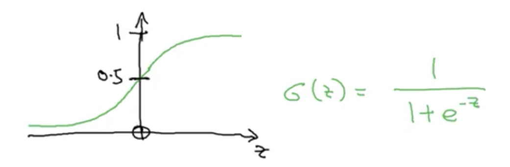

## What We Will Cover
* Vecotrization:  When working with neural networks and lots of data, you probably do not want to use
a for loop to go over each example in your training set during the training phase.
There are better ways -- vecotrized ways!
* Forward and Backward Propagation

These ideas will be conveyed using logistic regression, which is a typical way of introducing
neural networks and how to optmize them.  

## Logistic Regression
LogReg is a type of binary classifier, e.g., {cat, notCat}.

QUESTION:  If you have an image of cats and you want to classify whether or not the image has cats in it,
what do you consider your features?
  
In a 32x32 B&W image, one has 16x16 = 256 pixels, ranging in blackness from 0 to 255.  Each pixel
can be considered an input feature.  A single pixel's value likely has little to say about whether or
not a cat is in the picture---but consider a small neighborhood of pixels, e.g., a patch of pixels big
enough to capture a cat's ear.  Each pixel by itself hold very little information, but taken in the context
of its neighbors holds quite a bit (in a way, the whole is greater than the sum of its parts). 

As a human, we know that pixels are best considered in context, which is why convolutional neural networks
shine in the image recognition context.  However, context can be derived even with simple densely connected
neural networks.  In this setting, the computer is given a 256-dimensional vector.  Each pixel is presumed
to be independent of the other pixels.  But during the training phase, each node (decision maker) in the network
will begin to learn some context --- that certain pixels matter more than others to a particular decision being 
made.  

The same is true of color/RGB images.  An 16x16 RGB image has 3 16x16 layers instead of one, and so has
3x16x16 = 768 pixel features.  Again, though not the best method, a densely-connected NN can still learn
quite a bit about classification indicators in color/pixel neighborhoods for binary classification on small images.
Of course, as the image size grows in pixel area, this becomes more and more difficult to realize using
this approach.

---------------------------

## Notation
* Data Set has points (x,y), where x inhabits the feature space and y inhabits the target space
* Let m denote the number of data points
  - m_training is number of training points
  - m_test is number of test points
  - etc
* Feature Vector:  x in R^Nx
  - actually, this is notational convenience
  - e.g., when talking about B&W images, if U := {0, ..., 255} < Z, then x is in U^Nx
* Feature Matrix: X in (R^Nx)x(R^m)
  - X is a "horizontal stack" of feature vectors
  - NOTE:  this feature matrix has **Columnar Records** and each row is a feature, whereas in TensorFlow and the Udacity course, the data matrix has row records and each feature is a column
    * Ng says the columnar record approach makes implementing neural networks much easier
  - note that this changes the equations
    * Row Records (TF, Udacity):  xW + b --> y
    * Column Records (Ng):   Mu + d --> z 
    * CONVERSION:   (xW+b)^T = (xW)^T + b^T = (W^T)(x^T) + b^T = Mu + d
  - also note that in other classes, X[i,j] denotes the jth feature of the ith data point
    * in this class, X[i,j] denotes the ith feature of the jth data point
  - however, when using only one index, the notation is the same for both col/row record conventions:  X[i] stands for the ith data point
* Target Vector: y in {0,1}
* Target Matrix:  Y = [y[1], ..., y[m]]
  - in this course, Y is a "horizontal stack" of target vectors, whereas in the Udacity/TF course it was a vertical stack
  - since the target vectors in this lecture are 1-dimensional, the target matrix is 1xm

Just keep the convention in mind when programming since things like the components of input.shape
take on different meanings in the two conventions:
* Row Records:  input.shape = (num_rows, num_features)
* Col Records:  input.shape = (num_features, num_rows)

----------------------------------

## Logistic Regression (Theory)
* Given x, we want to know p = P(y=1|x), where p is an estimate of the probability that y=1 given x.
* Given that x is a feature vector from R^Nx, the parameter vector we want to learn will inhabit R^(Nx+1)
  - one weight coefficient for each feature, and one bias term
* In linear regression, we would have p = (w^T)x + b, but this cannot be used as an estimate of probability
* In logistic regression, we instead have p = sigmoid((w^T)x + b)



What does the sigmoid function do for us in terms of decision making?

If you look at the sigmoid equation, it says that large positive z values should indicate a "yes" (~1), 
wherease large negative z values should likely indicate a "no" (~0).  So in a regular logistic regression,
we have one node making the decision; this decision is made by learning the "best assumptions," i.e., the
values for w and b that will help the node estimate the probability.

Reminder:
* X[i,j] in this course stands for the ith feature of the jth data point
* if only one index is referenced, X[i] stands for the ith data point

## The LogReg Loss Function
### MSE
You can use the mean-squared error (MSE), however this produces a nonconvex optmization problem in the 
context of logistic regression.  That is, a detected minimum loss over the parameter space is not necessarily
the global minimum (gradient descent will not necessarily work well).  

In the follwing image "y hat" is the probability estimate (what I refer to as p above).


In complex neural networks, one might have to deal with this possibility.  However, in
a simple network like logistic regression, one can identify a loss function that does make for a convex
optimization problem (the detected minimum is the global minimum).

### Cross Entropy
In the follwing image "y hat" is the probability estimate (what I refer to as p above).


If you look at the equation, the prediction ("y hat") and the actual ("y") have separate roles.  
* the actual's role is to determine which term in the sum should be considered
* the prediction's role is to be compared to how close it is what its supposed to be

This observation tells us that this loss function is not a distance metric: it is not symmetric in its input arguments.

If you think about entropy from physics, this is kind of like saying that you can increasingly
add order to a partially-disordered system, but can never again add order to a fully-disordered system.
In terms of information, it is like saying that a partially-ignorant can always strive towards
minimizing its ignorance (e.g., using deduction, past experience, etc), but that a fully-ignorant agent
will always be fully ignorant (e.g., has no knowledge of deductive reasoning, has no memory of past experience, has
no ability to link two bits of information, etc).  Any of that help?  

Another thought: the role played by the actual is that of perfect information. For simplicity,
consider a parabola z = w^2.  Getting to z=0 can only be done in one way -- continuously head
towards zero.  That is, to achieve a state of perfect information, continously reduce your
ignorance.  However, to get to any other state, z=a, at its simplest one must choose one of
two directions to proceed from perfection.  That is, getting to imperfection from perfection
is not well-defined like it is to get to perfection from imperfection!  

Thinking this through, one can actually realize that the roles of the prediction and the actual
in symmetric loss functions are different as well, but the symmetry hides this insight a bit.

## The LogReg Cost Function
Andrew Ng follow the convention I typically like, though it is not universal.  The loss function
refers to how you measure the error at a single data point, while the cost function refers to
how you measure the error over a group of data points (sometimes the entire data set, but more freqently
in "mini-batches" of the data set).


In physics speak, this is somewhat similar to defining a Lagrangian, then defining the action of that Lagrangian, and
finally minimizing the action to solve for the equations of motion.

## The Gradient Descent Algorithm 

Recap: 
* The function to fit:  p = sigmoid(<w,x>+b), where sigmoid(z) = 1/(1+exp(-z))
* The loss incurred at a single data point: L(p[i],y[i]) = -((1-y[i])log(1-p[i]) + y[i]log(p[i]))
* The cost (avg loss) of that fit: J(w,b) = avg{i}{L(p[i],y[i])}

This cost function is convex:


This is good b/c if we can find a minimum of it, then we are assured it is the global minimum.

But how do we figure out which values of w and b will minimize the cost function?  How do we even
know where to start?

It is best to randomly initialize the parameters in general. However, since we know this cost function
is convex, it basically does not matter how we initialize the parameters: randomly, uniformly, whatever.

Gradient descent is all about choosing a path through the parameter space --- preferably the quickest 
path to the global minimum.  Again, in physics speak, action integrals and lagrangians.  Geodesics.
One wants to minimize a functional here: to determine the Lagrangian (loss function) 
that minimizes the action (cost function)!  So, what's the best way?  Compute the gradient and head in
the opposite direction.

In the one-dimensional setting, the gradient is just the plain ol' derivative.  In the image above, we
have a parabola, J(w) = a\*w^2.  Its gradient is dJ/dw = 2aw, which defines the slope of the line tangent
to the point (w, J(w)).  Note that when the gradient is positive, we want to move in the negative direction
to head towards the minimum, and vice versa for a negative gradient.  


In code, the dervitive dJ/dw is often denoted as dw.  This is kind of shorthand for "delta w", even though
one might argue that "delta w" is (-1)(alpha)(dJ/dw) since that would make more sense given the typical 
increment equation "w + dw".  But if you think about a differential form, you can just imagine that the 
dw refers to which component of the gradient is under consideration:  

<center>dJ = (dJ/dw)dw = (dJ/dw[1])dw[1] +...+ (dJ/w[Nx])dw[Nx] + (dJ/db)db</center>


Whatever way you remember, it is what it is.  There's the actual math, then there's the notation conventions
used in code.  (This is why it's good to know WTF you are doing!)


Andrew Ng says he doesn't like the distinction between partial derivatives (using curly d) and regular derivatives 
from univariate calculus, which use the regular d.  He said that it causes more confusion than it's worth... Maybe
he's right, but one would still then need a notation to distinguish between partial and total derivatives.  
Maybe it's not a huge concern in various ML tasks, but it is an essential distinction in most of physics, e.g., 
fluid dynamics, Lagrangians, etc.

**NOTE**: This gradient descent update algorithm is conceptual in that it tells us how we should proceed
through the parameter space, but doesn't describe how to actually compute the derivatives.  In a single-layer
model like linear or logistic regression, this is not a huge concern.  However, as you build layers into a model,
the weights in various layers are technically functions of weights in other layers.  In short, one needs to know
how to compute derivatives via the chain rule as one traverses the graph model of the neural network.  This is
where the backpropagation algorithm comes into play...which I'm sure Ng will talk more about later.


## Derivatives
This module is just a review for people who are rusty or for some reason are taking this course with almost zero math background...


## The Computation Graph
Whenever you have a function made up of multiple operations, you can rewrite as a function composition sequence.

Example: 
* Say you have a function J(a,b,c) = 3(a + bc)
* However, note that you must compute u=bc before computing v=a+L, before computing J=3v
* In other words, J(a,b,c) = 3(a + u(b,c)) = 3v(a,b,c)
  - written as a function composition:   J(K(a, L(b,c)))
  - or as a computation graph: 
  
So whenever you have a computation graph representation of a function, you can compute the value of the
function given the input by doing a left-to-right traversal of the graph, known as a "forward pass."

As we will see, one can then compute the multi-layer structure of derivatives in a backward pass.

## Derivatives of a Computation Graph  (BackProp)

Again we find that, in code, dJ/dvar is notated as dvar.  And again, one can remember this relationship
however they please... 
* One way is to just remember that "dvar" is the unique part of dJ/dvar. So, instead
of writing dJ\_over\_dvar, we more simply write "dvar."  
* The other way is just thinking in terms of differential forms, and noting that "dvar" is the component 
of the differential in the "dvar" direction:  dJ = (dJ/dvar1)dvar1 +...+ (dJ/dvarN)dvarN

The idea is to compute the derivatives layer-wise (or w/ a topological sort) s.t. one can use
previously computed derivatives to compute left-ward derivatives via the chain rule...


## Logistic Regression Gradient Descent


## Gradient Descent on m-Sized Batches
Recap:
* J(w,b) = avg{i}{L(p[i],y[i])}
* p[i] = sigmoid(z[i]) = sigmoid(<w,x[i]>+b)

Derivative of the cost function: instead of just taking the derivative of the loss function 
at a single data point, we compute the derivative at a batch of data points:
* Equation:  dJ/dw[i] = avg{i}{dL/dw[i]}
* In Code: dw\_avg = mean(dw)

Here is a "naive" implementation:
```python
J=0; dw1=0; dw2=0; db=0  # J(w,b), dJ/dw1, dJ/dw2, dJ/db
for i in range(0,m):
  z[i] = np.dot(w, x[:,i])
  p[i] = sigmoid(z[i])
  J += -( y[i]*log(p[i]) + (1-y[i])*log(1-p[i]) )
  dz = p[i] - y[i]  # dJ/dz
  dw1 += x[1,i]*dz  # coeff of feature1, dJ/dw1
  dw2 += x[2,i]*dz  # coeff of feature2, dJ/dw2
  db  += dz         # dJ/db
# Currently have summed loss and summed derivatives
#  -- want cost (average loss) and avg derivatives
J /= m;  dw1 /= m;  dw2 /= m;  db /= m
# Gradient Descent: Where is our next step in parameter space?
w1 = w1 - lrn_rt*dw1  # i.e., w1_new = w1_old - lrn_rt * dJ/dw1
w2 = w2 - lrn_rt*dw2  # i.e., w2_new = w2_old - lrn_rt * dJ/dw2
b  = b - lrn_rt*db    # i.e.,  b_new =  b_old - lrn_rt * dJ/db
```

This implementation is not vectorized:  we have 2 features here, so it seems harmless,
but what if you have 5000 features?  Would you write it all out?  No.  Would you implement a
second forLoop?  Maybe, but you shouldn't.  Even the forLoop we implemented of the data points
is inefficient as one's data gets big.  Instead, you should stick to vectorized calculations,
which we cover in the next section. 


# Python & Vectorization
## Vectorization
Vectorization is the art of getting rid of for loops in your code.

Without vectorization, in the age of deep learning and "big data," you will likely sit around too much.
In fact, you could sit around so much that you lose interest in your project. And that's not good!

DON'T DO:
```python
z=0
for i in range(num_ftrs):
  z += w[i]*x[i]
z += b
```
INSTEAD, DO:
```python
z = np.dot(w,x) + b # (w^T)x + b
```

Vectorized computations are very quick (takes about 1.5-2.0 ms):


Non-vectorized, for-looped computations are very slow (takes about 450-500 ms):


Both compute the same number!  One method is ~300x slower.  Your choice.

----------------------------------------

### GPU vs CPU
You've likely heard about GPU computing for deep learning, but we've been doing parallelized CPU computing.

By using NumPy's vectorized methods, you allow Python/C to leverage multiple CPUs on your computer.

SIMD: single instruction multiple data

-------------------------------------------

Take Away:  Whether using GPUs, CPUs, or both, avoid using explicit for loops.
NumPy includes a bunch of functions that are already vectorized, so use them!
(e.g., np.exp, np.log, np.maximum, etc)

## Vectorized GradDesc for LogReg
When I was taking notes before, I actually injected some vectorization (np.dot).  But the goal
here is to fully vectorize.

Here we deal with the "feature for loop"
```python
dw = np.zeros((num_ftrs, 1))  # dJ/dw
J=0; db=0                     # J(w,b), dJ/db
for i in range(0,m):
  z[i] = np.dot(w, x[:,i])
  p[i] = sigmoid(z[i])
  J += -( y[i]*log(p[i]) + (1-y[i])*log(1-p[i]) )
  dz = p[i] - y[i]  # dJ/dz
  dw += x[:,i]*dz   # gradient wrt weights, dJ/dw1
  db  += dz         # dJ/db
# Currently have summed loss and summed derivatives
#  -- want cost (average loss) and avg derivatives
J /= m;  dw /= m;  db /= m
# Gradient Descent: Where is our next step in parameter space?
w = w - lrn_rt*dw    # i.e., w_new = w_old - lrn_rt * dJ/dw
b  = b - lrn_rt*db   # i.e.,  b_new =  b_old - lrn_rt * dJ/db
```

We can do even better than this!  No for loops at all.

Remember:  Ng uses columnar records
* 

We covered this a bit already above when talking about the notation used for this course.
Basically, instead of having separate vectors for each record, just make a matrix of such
vector records.  In TF and Udacity's DL nanodegree, this is a matrix of row records.
In Ng's course, this is a matrix of column records.  Importantly, it allows NumPy to 
vectorize computations across the data set.


`(np.dot(w.T,X) + B)[i] = w[j]X[j,i] + b`

B is the broadcast of b. That is, in Python/NumPy lingo, adding a scalar to a vector is called
broadcasting...which means that the scalar is treated as <b, b, ..., b>.  This abuse of notation
is used all over math and physics, but I've never seen it called broadcasting outside of the various
ML/DL courses I've taken.

So we have vectorized Z, but what do we do about the sigmoid activation of Z?
Fortunately, NumPy's exponential function, np.exp, is already vectorized, so we
can use it in our definition of the sigmoid function, which gives us a vectorized
sigmoid function:
```python
# A = [a[1], a[2], ..., a[m]] = sigmoid(Z) = sigmoid([z[1], z[2], ..., z[m]])
import numpy as np
def sigmoid(z):
  return 1./(1+np.exp(z))
Z = np.dot(w.T, X) + b
A = sigmoid(Z)
```

## Vectorizing Gradient Descent
Before we found that dJ/dz, denoted in code as "dz", for a given data point, i, was
```
dzi = a[i] - y[i]  #  a[i] was called p[i] in some of my earlier notes
```

Vectorizing this (and other quantities) is simple. Here we get rid of the for loop
over the data range.
```python
import numpy as np
def sigmoid(z):
  return 1./(1+np.exp(z))
Z = np.dot(w.T, X) + b
A = sigmoid(Z)
dZ = A - Y
dw = np.dot(X, dZ.T)/m
db = np.sum(dZ)/m
w = w - lrn_rt*dw
b = b - lrn_rt*db
```
Note that we're not keeping track of the cost here.  That's ok, technically, since the equations
we derived are track are in reference to the cost function.  That said, often one might want to
track the cost for visualization or early-stopping purposes.

-------------------------------------------
What's the problem?

We actually only did one iteration of gradient descent.  We got rid of all the for loops within that
iteration of gradient descent, but still -- we only took one step down the hill!

One step down the hill is sometimes called an epoch.  Oftentimes, we run a gradient descent for 10, 100, or
even 1000 epochs.  This requires a for loop.  Furthermore, since each subsequent value depends on the value before it,
this for loop is not parallelizable / vectorizable.  

Moral:  Avoid all unnecessary for loops, however some for loops are unavoidable.

-------------------------------------------------------------

