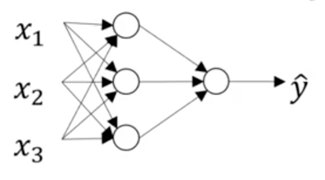

##Typical 2-Layer NN Representation
Oftentimes, a NN is represented as follows:

In this representation, each node represents both the linear transformation and subsequent activation.
The edges represent matrix weights.

Note that "nodes" are just the components of a vector.

Also note that this is called "2 layer" b/c the input layer is not counted in this nomenclature.

## Notational Representation
How should we identify which layer a matrix weight or node is referring to?
Ng uses a square-bracketed superscript, like so:

However, in this markdown file, we will just put the layer number after a semi-color, e.g.,
W[i,j;k] is the (i,j)th weight of the matrix flowing into layer k.

If we are not specifying matrix components, the notation in these markdown files will
look like W[;k].  

## Some Terminology


Note the following notational representations:

* a[i,j;0] = identity(x[i,j]) = x[i,j]: the activation on the input layer is the identity function, i.e.,
   the "output values" in the input layer are transferred to the first hidden layer unchanged
* z[;1] = <w[;1],x>+b
* a[;1] = activation(z[;1])

A particular "node" in a layer refers to a particular component of the layer vectors, e.g., in a
3-node layer

## Algebratize!


z[i,j;L] = w[i,k;L]a[k,j;L-1] + b[i,j;L]   # Einstein summation for pre-semicolon indices
a[i,j;L] = activation(z[i,j;L])

For L=1, x[i,j] = a[k,j;0]

## Choice of Activation Function
Sigmoid activation is a great way to introduce activation functions:
* it's differentiable (as opposed to the step function used in a perceptron)
* it's used in logistic regression
* logistic regression can be set up as a simple neural network

However, it's not really a great activation function to use on a bunch of hidden layers.  
People like it b/c it's theoretically pleasing... But a related activation, tanh, 
usually works much better in practice. Ng says, "I pretty much never use a sigmoid activation
function anymore... tanh is always superior. The one exception is for an output layer."

Why is tanh better in practice? "The tanh activation usually works better than sigmoid activation function 
for hidden units because the mean of its output is closer to zero, and so it centers the data better for 
the next layer."

Action both the "sigmoid fcn" and tanh are considered sigmoid functions.  What we call the
"sigmoid fcn" is also known as the logistic funtion.  

Sigmoid and Tanh can both stall learning... Both saturate on large postive and negative values,
inducing a vanishing gradient --- and so small-to-no updates.  

The solution? The REctified Linear Unit (RELU):  relu(x) = max(0,x)

The fact that RELU is not strictly differentiable does not matter in practice.  However, the 
vanishing gradient still exists for negative values...  For many applications, this doesn't matter.
However, if it does, then a leaky RELU is better:  lrelu = max(alpha*x, x), where alpha is a shrink parameter.

In practice, using a RELU trains a network much faster than sigmoid or tanh activations b/c
it addresses the vanishing gradient enough...

Sigmoid:  Never use except on output layer
Tanh:  If you think you want sigmoid on a hidden layer, use tanh instead
Relu: If you're thinking about using tanh, just F'n use the RELU
Leaky Relu:  This might help. 

## So many choices
That's deep learning.  Deal with it!  If you're not sure, try 'em all.  Start w/ best practices,
but always explore a bit.  Usually the type of problem you are working on is most amenable to a 
certain set of choices.

## The purpose of the nonlinear activation function
To. Add. Nonlinearity.  

That's it!

Without a nonlinear activation, the composition of linear transformation is just a linear transformation.
Thus the nonlinear activations allow the network to learn nonlinear functions!

"A linear hidden layer is more-or-less useless." --Ng

If the last layer is supposed to be a regression, then a linear transformation might be best.  
However, even in the regression case that's not always true: RELU is better for predicting 
house prices b/c it does not allow negative values.


## Eqns for a 2-Layer Network for Binary Classification
Forward Propagation
* z1 = w1X + b1
* a1 = g1(z1)
* z2 = w2a1 + b2
* a2 = sigmoid(z2)

Backward Propagation
* dz2 = a2 - y
* dw2 = (1/m)(dz2)(a1)^T
* db2 = (1/m)np.sum(dz2, axis=1, keepdims=True)
* dz1 = (w2)^T(dz2)\*g1'(z1)
* dw1 = (1/m)(dz1)x^T
* db1 = (1/m)np.sum(dz1, axis=1, keepdims=True)

Remember: dq is code notation for dJ/dq

## Derivation of the BackProp Eqns for the Logistic Regression Network
Warning: Slight abuse of notation: partial derivatives are not denoted w/ curly d, but it should be obvious that they're partials

* Network:  (x,w,b) --> z=(w^T)x+b --> a=sigmoid(z) --> L(a,y) 
* Loss Fcn: L(a,y) = -y\*log(a) - (1-y)\*log(1-a)
* da := dL/da = -y/a + (1-y)/(1-a)
* dz := dL/dz = (dL/da)(da/dz) = da\*sigmoid'(z) = da\*sigmoid(z)\*(1-sigmoid(z))
* dw := dL/dw = (dL/da)(da/dz)(dz/dw) = dz\*d(w^Tx)/dw = dz\*d(x^Tw)/dw = dz\*x^T
   - see [here](https://math.stackexchange.com/questions/20694/vector-derivative-w-r-t-its-transpose-fracdaxdxt) for info on d(w^Tx)/dw
* db := dL/db = (dL/da)(da/dz)(dz/db) = dz\*(db/db) = dz

## Derivation of the BackProp Eqns for the 2-Layer Binary Classification Network
Warning: Slight abuse of notation: partial derivatives are not denoted w/ curly d, but it should be obvious that they're partials

* Network: (x,w1,bb) --> z1=(w1^T)x+b1 --> a1=sig(z1) --> z2=(w2^T)a1+b2 --> a2=sig(z2) --> L(a2,y)
* Loss Fcn: L(a2,y) = -y\*log(a2) - (1-y)\*log(1-a2)
* da2 := dL/da2 = -y/a2 + (1-y)/(1-a2)
* dz2 := dL/dz2 = (dL/da2)(da2/dz2) = da2\*sig'(z2)
* dw2 := dL/dw2 = (dL/da2)(da2/dz2)(dz2/dw2) = dz2\*a1^T
* db2 := dL/db2 = (dL/da2)(da2/dz2)(dz2/db2) = dz2\*(db2/db2) = dz2
* da1 := dL/da1 = (dL/da2)(da2/dz2)(dz2/da1) = dz2\*w2^T
* dz1 := dL/dz1 = (dL/da2)(da2/dz2)(dz2/da1)(da1/dz1) = da1\*sig'(z1)
* dw1 := dL/dw1 = dz1\*dz1/dw1 = dz1\*x^T
* db1 := dL/db1 = dz1\*(db1/db1) = dz1

A sanity check is to ensure that dim(dfoo) == dim(foo).

Also, in practice, we do not want to work with the loss function (single data point at a time), but the cost function.
Importantly, we want to use NumPy operations to vectorize the operations.  The derivation is almost nearly the same.

## Random Initialization
Do not initialize all parameters to zero!  Bad!  But you can do that with the biases as long as you randomly initialize
the weights.

The reason is interesting: by initializing all parameters to zero, each neuron starts out identical.  The symmetry
is nearly unbreakable... It is essential to begin training with broken symmetry.  That is, a diversity of neuron
states is necessary to properly learn.

```python
w1 = np.random.randn((2,2))*0.01
b1 = np.zeros((2,1))
w2 = np.random.randn(...)
# etc
```

Initializing weights to very small values is pretty important since we use activation functions
that become insensitive to variation in numbers outside of [0,1] for sigmoid or [-1,1] for tanh, etc.

But should we always multiply by 0.01?

It works well for a lot of projects, but there are actually some formulas that have been developed to
ensure the weights are initialized small enough depenedent on the layer size, e.g., the first hidden
layer can have weights initialized using a truncated normal distribution with stdDev set to sqrt(2/n\_features).


## Review of Ng's Notational Representation
To specify which layer we are talking about, Ng uses a square-bracketed superscript, like so:


To specify which data point we are talking about, Ng uses are paranthetical superscript.

To specify which neuron we are talking about, Ng uses a subscript.

The notational representation of layer l, 1<=l<=L:
* Z^[l] = W^[l]A^[l-1]+B^[l]
* A^[l] = g(Z^[l])

Remember: Ng represents data records in columns, not rows.  So the weight shapes as you scan across
a network diagram are the transposes of what you would need to use in TensorFlow.

For example, say you have a binary classification network that begins with 3 features, mapping to 5 hidden features,
which maps to the classification (1 node).

* in TF, weights would be:  (3,5), (5,1)
* w/ Ng's format: (5,3), (1,5)

